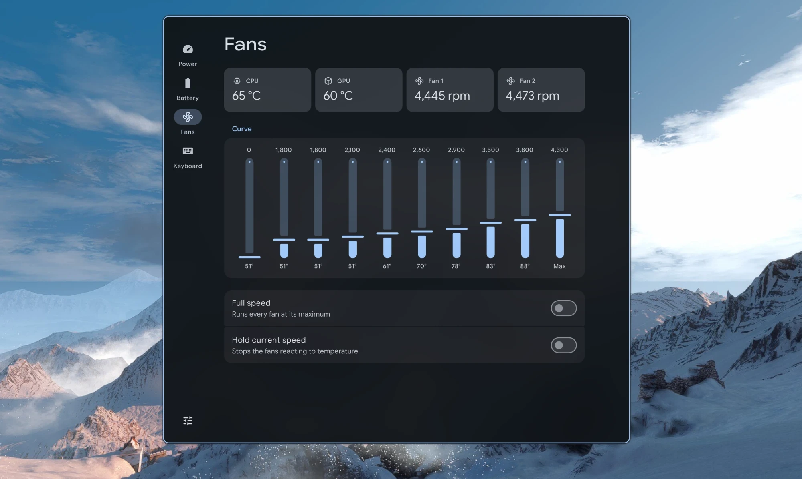

<div align="center">



<a href="https://buymeacoffee.com/e_gurl">
  
</a>

# Cohort

**Power, battery, fan and keyboard settings for Lenovo Legion laptops on Linux.**

Lenovo's own apps don't run on Linux. Cohort changes the same settings through the drivers Linux already has, in a native Material 3 window.

Free software (GPL-3.0-or-later). Not made or endorsed by Lenovo.

[Install](#install) · [Fan control](#fan-control-optional) · [Troubleshooting](#troubleshooting)

</div>

## Features

- **Power:** Quiet, Balanced, Performance, Custom (and Extreme where supported). In Custom, set the firmware's CPU and GPU power limits. Switch modes automatically when you plug in or unplug.
- **Battery:** Conservation, Standard or Rapid charging, always-on USB, and battery health.
- **Fans:** temperatures, fan speeds, and your own fan curve: speed, CPU, GPU and chipset thresholds, and ramp speed for every step. Reset to the firmware's curve at any time.
- **Keyboard:** four-zone RGB lighting, backlight on and off, Fn lock, Windows key, touchpad and logo light.
- **Stays applied:** a small background service puts your fan curve and lighting back after restarts, sleep and mode changes.
- **Keybinds:** change modes, charging and lighting from the command line.

Cohort only shows what your laptop supports, and follows your desktop's colours, theme and font. The window adapts to its size, and Settings has four interface sizes.

## Requirements

| You need | Why | Check |
| --- | --- | --- |
| Linux 6.17 or newer | Power modes, charging, Fn lock | `uname -r` |
| Qt 6.8 or newer | The window | installed by the commands below |
| polkit | Changing settings | installed by the commands below |
| [LenovoLegionLinux](https://github.com/johnfanv2/LenovoLegionLinux) kernel module (optional) | Fan curves, fan speeds, hybrid graphics, overdrive, Windows key, touchpad, logo light | `lsmod \| grep legion_laptop` |

Keyboard lighting works on 2020 to 2024 Legion 5, Legion 5 Pro, IdeaPad Gaming and LOQ laptops without anything extra.


## Install

Pick your distribution. Each block installs the build tools, builds Cohort and installs it. You'll be asked for your password once.

<details>
<summary><b>Arch, CachyOS, EndeavourOS, Manjaro</b></summary>

```bash
sudo pacman -S --needed base-devel git
git clone https://github.com/yappologistic/Cohort.git
cd Cohort/packaging/arch
makepkg -si
```
</details>

<details>
<summary><b>Fedora</b></summary>

```bash
sudo dnf install gcc-c++ git cmake ninja-build qt6-qtbase-devel qt6-qtdeclarative-devel qt6-qtsvg-devel polkit
git clone https://github.com/yappologistic/Cohort.git
cd Cohort
./scripts/install.sh
```
</details>

<details>
<summary><b>Debian 13, Ubuntu 25.04 or newer, Linux Mint 23</b></summary>

```bash
sudo apt install build-essential git cmake ninja-build qt6-base-dev qt6-declarative-dev qt6-svg-dev \
  qml6-module-qtquick qml6-module-qtquick-controls qml6-module-qtquick-layouts \
  qml6-module-qtquick-shapes qml6-module-qtquick-templates qml6-module-qtquick-window polkitd pkexec
git clone https://github.com/yappologistic/Cohort.git
cd Cohort
./scripts/install.sh
```

Ubuntu 24.04 and Mint 22 have Qt 6.4, which is too old.
</details>

<details>
<summary><b>openSUSE Tumbleweed</b></summary>

```bash
sudo zypper install gcc-c++ git cmake ninja qt6-base-devel qt6-declarative-devel qt6-svg-devel polkit
git clone https://github.com/yappologistic/Cohort.git
cd Cohort
./scripts/install.sh
```
</details>

<details>
<summary><b>Void Linux</b></summary>

```bash
sudo xbps-install gcc git cmake ninja qt6-base-devel qt6-declarative-devel qt6-svg-devel polkit
git clone https://github.com/yappologistic/Cohort.git
cd Cohort
./scripts/install.sh
```
</details>

<details>
<summary><b>NixOS</b></summary>

Add Cohort to your flake:

```nix
{
  inputs.cohort.url = "github:yappologistic/Cohort";

  outputs = { nixpkgs, cohort, ... }: {
    nixosConfigurations.your-host = nixpkgs.lib.nixosSystem {
      modules = [
        cohort.nixosModules.default
        { programs.cohort.enable = true; programs.cohort.legionModule = true; }
      ];
    };
  };
}
```

`legionModule = true` also installs the fan control module. Leave it out if you don't want it.
</details>

Then open **Cohort** from your app launcher.

## Fan control (optional)

Fan curves and the extra switches need LenovoLegionLinux's kernel module. Check that your model is in [its supported list](https://github.com/johnfanv2/LenovoLegionLinux#pushpin-confirmed-compatible-models) first.

**1. Install the module.**

- **CachyOS:** `sudo pacman -S lenovolegionlinux-dkms`
- **Arch:** install `lenovolegionlinux-dkms-git` from the AUR, for example `paru -S lenovolegionlinux-dkms-git`
- **Other distributions:** follow [LenovoLegionLinux's install guide](https://github.com/johnfanv2/LenovoLegionLinux#bulb-instructions)

**2. On kernel 6.17 or newer, let it share with the built-in drivers.** From the Cohort folder:

```bash
sudo install -Dm644 packaging/legion_laptop.conf /etc/modprobe.d/legion_laptop.conf
```

This keeps power modes with the built-in drivers and adds the module's fan control beside them. Skip this step on older kernels.

**3. Load it.** It loads by itself at every boot after this.

```bash
sudo modprobe legion_laptop
```

## Keybinds and scripts

```bash
cohort --mode next          # cycle Quiet, Balanced, Performance, like Fn+Q
cohort --mode performance   # or quiet, balanced, extreme, custom
cohort --charge rapid       # or conservation, standard
cohort --lighting off       # or static, breath, wave, smooth
cohort --backlight high     # or off, low
cohort --status             # mode, charging, temperatures, fans
```

For example, in Hyprland's config: `bind = SUPER, F5, exec, cohort --mode next`

## Background service

Cohort starts a small background service when you log in. It puts your fan curve and keyboard lighting back after restarts, sleep and mode changes, and switches the power mode when you plug in or unplug if you turned that on. It does nothing while nothing changes.

Turn it off in **Settings → Run in background**. If your desktop doesn't run autostart entries, opening Cohort starts it.

## Uninstall

On Arch-based systems, run `sudo pacman -R cohort-git`. Everywhere else, run `./scripts/uninstall.sh` from the Cohort folder. Your settings are kept in `~/.config/cohort/`; delete that folder too if you want them gone.

## Troubleshooting

- **A setting is missing:** your kernel or laptop doesn't provide it. See [Requirements](#requirements).
- **"Permission … was not given":** you're not in an active local session, so polkit wants a password, and no authentication agent is running to ask for it. Start one, such as `hyprpolkitagent` or `polkit-gnome`.
- **"… can only be changed in the Custom power mode":** switch to Custom first. The firmware only accepts power limits there.
- **The fan curve resets after changing mode:** the firmware loads a curve per mode. Cohort puts yours back as long as the background service is on (Settings → Run in background).

## Privacy and permissions

Cohort makes no network connections and collects nothing.

Settings are changed by a small helper, `cohort-helper`, through polkit. It can only change the settings listed in `src/controls.cpp`, and only to values the driver accepts. If you're at the laptop, polkit allows changes without a password, the same way your desktop's power menu works.

## Development

```bash
./scripts/build.sh     # build into build/
./scripts/test.sh      # unit tests
./scripts/verify.sh    # tests, a simulated user, and screenshots of every page
```

The tests run against fake laptops made of sysfs files, so they need no Legion hardware. Please open an issue before starting a large change.

## License

[GPL-3.0-or-later](LICENSE). Third-party credits are in [NOTICE](NOTICE). Material Symbols icons are [Apache 2.0](licenses/MaterialSymbols-LICENSE.txt). Lenovo and Legion are trademarks of Lenovo, used only to say which laptops Cohort supports.
