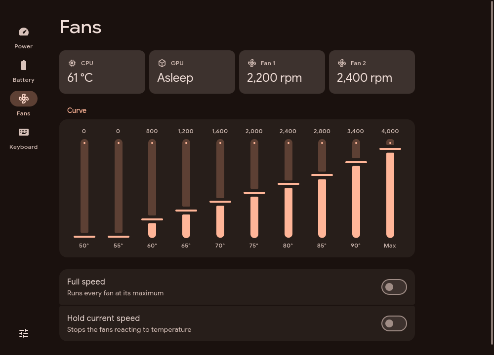

<h1 align="center">Cohort</h1>

<p align="center">Power, battery, fan and keyboard settings for Lenovo Legion laptops on Linux.</p>

<p align="center">
  
</p>

<p align="center">
  <a href="#install">Install</a> ·
  <a href="#what-it-does">Features</a> ·
  <a href="#what-your-laptop-needs">Requirements</a> ·
  <a href="#troubleshooting-and-privacy">Help</a> ·
  <a href="#license">License</a>
</p>

Lenovo Vantage and Legion Space do not run on Linux. Cohort changes the same settings through the drivers Linux already has, in a native Qt interface that follows Material Design 3.

**Free software · GPL-3.0-or-later.** Not made, endorsed or supported by Lenovo.

## What it does

- **Power:** switch between Quiet, Balanced, Performance and Custom, plus Extreme where the firmware has it. Fn+Q changes show up straight away. In Custom, set the CPU and GPU power limits the firmware publishes. Hybrid graphics and display overdrive are here too.
- **Battery:** choose Conservation, Standard or Rapid charging. Turn on always-on USB. See charge, power draw, health and cycle count.
- **Fans:** see CPU and GPU temperatures and fan speeds. Draw the fan curve step by step, run the fans at full speed, or hold them at their current speed.
- **Keyboard:** set the four-zone lighting (static, breath, wave or smooth) with a colour for each zone, plus brightness, speed and direction. Toggle Fn lock, the Windows key, the touchpad and the lid logo light.

Cohort only shows controls your laptop actually has. It follows your desktop's colours (including Noctalia's palette), light or dark theme and font. Animations can be turned off in Settings.

## What your laptop needs

Cohort talks to kernel drivers, never to the firmware directly. What you see depends on which drivers your kernel has:

| Feature | Comes from |
| --- | --- |
| Power modes | `lenovo-wmi-gamezone` (kernel 6.17 and later) or LenovoLegionLinux |
| Custom power limits | `lenovo-wmi-other` (kernel 6.17 and later), on laptops whose firmware supports it |
| Conservation and Rapid charging | `ideapad-laptop` (kernel 6.17 and later; Rapid from 6.19), or LenovoLegionLinux on older kernels |
| Always-on USB, Fn lock | `ideapad-laptop` |
| Fan curve, full speed, hold speed | [LenovoLegionLinux](https://github.com/johnfanv2/LenovoLegionLinux)'s kernel module |
| Hybrid graphics, overdrive, Windows key, touchpad, logo light | LenovoLegionLinux's kernel module |
| Four-zone keyboard lighting | Built in. Works on 2020–2024 Legion 5, Legion 5 Pro, IdeaPad Gaming and LOQ keyboards |

Fan curves need the LenovoLegionLinux kernel module. Check [its list of supported models](https://github.com/johnfanv2/LenovoLegionLinux#supported-models) for yours. Install the module with:

- **Arch, CachyOS:** `sudo pacman -S lenovolegionlinux-dkms` on CachyOS, or `lenovolegionlinux-dkms-git` from the AUR
- **NixOS:** set `programs.cohort.legionModule = true;` (see below)
- **Other distributions:** follow [LenovoLegionLinux's installation guide](https://github.com/johnfanv2/LenovoLegionLinux#installation)

## Install

Cohort needs Qt 6.8 or newer and polkit. It installs system-wide because polkit only reads policies from `/usr/share/polkit-1/actions`.

<details>
<summary><b>Arch, CachyOS, EndeavourOS, Manjaro</b></summary>

```bash
git clone https://github.com/yappologistic/Cohort.git
cd Cohort/packaging/arch
makepkg -si
```
</details>

<details>
<summary><b>Fedora</b></summary>

```bash
sudo dnf install gcc-c++ git cmake ninja-build qt6-qtbase-devel qt6-qtdeclarative-devel qt6-qtsvg-devel polkit
git clone https://github.com/yappologistic/Cohort.git
cd Cohort
./scripts/install.sh
```

`packaging/fedora/cohort.spec` builds an RPM instead.
</details>

<details>
<summary><b>Debian 13, Ubuntu 25.04 and newer, Linux Mint 23</b></summary>

```bash
sudo apt install build-essential git cmake ninja-build qt6-base-dev qt6-declarative-dev qt6-svg-dev \
  qml6-module-qtquick qml6-module-qtquick-controls qml6-module-qtquick-layouts \
  qml6-module-qtquick-shapes qml6-module-qtquick-templates qml6-module-qtquick-window polkitd pkexec
git clone https://github.com/yappologistic/Cohort.git
cd Cohort
./scripts/install.sh
```

Ubuntu 24.04 and Linux Mint 22 ship Qt 6.4, which is too old. Install Qt 6.8 or newer from Qt's online installer, then pass `-DCMAKE_PREFIX_PATH=/path/to/Qt/6.x/gcc_64` to `./scripts/build.sh`.
</details>

<details>
<summary><b>openSUSE Tumbleweed</b></summary>

```bash
sudo zypper install gcc-c++ git cmake ninja qt6-base-devel qt6-declarative-devel qt6-svg-devel polkit
git clone https://github.com/yappologistic/Cohort.git
cd Cohort
./scripts/install.sh
```
</details>

<details>
<summary><b>Void Linux</b></summary>

```bash
sudo xbps-install gcc git cmake ninja qt6-base-devel qt6-declarative-devel qt6-svg-devel polkit
git clone https://github.com/yappologistic/Cohort.git
cd Cohort
./scripts/install.sh
```
</details>

<details>
<summary><b>NixOS</b></summary>

Add the flake to your system configuration:

```nix
{
  inputs.cohort.url = "github:yappologistic/Cohort";

  outputs = { nixpkgs, cohort, ... }: {
    nixosConfigurations.your-host = nixpkgs.lib.nixosSystem {
      modules = [
        cohort.nixosModules.default
        { programs.cohort.enable = true; programs.cohort.legionModule = true; }
      ];
    };
  };
}
```

The module installs Cohort where polkit can find its policy. `legionModule` also loads the LenovoLegionLinux kernel module. `nix run github:yappologistic/Cohort` starts the window, but changing settings needs the module.
</details>

<details>
<summary><b>Any other distribution</b></summary>

You need a C++20 compiler, CMake 3.24 or newer, Ninja, Qt 6.8 or newer (Base, Declarative with Quick Controls, Shapes and Layouts, and Svg), and polkit. Then:

```bash
git clone https://github.com/yappologistic/Cohort.git
cd Cohort
./scripts/install.sh
```
</details>

Open **Cohort** from your application menu. To remove it, run `./scripts/uninstall.sh` from the same folder, or remove the package. Settings stay in `~/.config/cohort/` until you delete them.

## How changes are made

The window runs as you and reads everything without special permissions. Changing a setting needs root, so the window asks `cohort-helper` to make the change through polkit.

- **The helper only makes a fixed set of changes.** Each change is checked against the values the driver accepts before anything is written. The helper cannot be pointed at any other file.
- **There is usually no password prompt.** If you're at the machine in an active local session, polkit allows the change without asking, the same way power-profiles-daemon allows power mode changes. Remote and inactive sessions need an administrator.
- **power-profiles-daemon stays in sync.** If it's running, Quiet, Balanced and Performance are set through it, so your desktop's power menu agrees with Cohort.

Running Cohort from a build folder without installing it works too. Every change then asks for an administrator's password, because polkit only trusts the helper at its installed path.

## Troubleshooting and privacy

- **A page says a feature is missing:** your kernel doesn't provide that driver. See [What your laptop needs](#what-your-laptop-needs). `uname -r` shows your kernel version.
- **The fan curve changes back after switching modes:** the firmware loads each mode's own fan curve. Cohort remembers the curve you set for each mode and puts it back while it is open.
- **"Permission to change … was not given":** a polkit authentication agent must be running. Most desktops start one. On a bare compositor, start one, such as `polkit-gnome` or `hyprpolkitagent`.
- **"… can only be changed in the Custom power mode":** the firmware only accepts power limits and some fan settings in Custom mode.
- **Keyboard lighting shows the wrong colours after a reboot:** the keyboard can't report what it's showing, so Cohort shows the last colours it sent.

Cohort makes no network connections and collects nothing. Its settings are stored in `~/.config/cohort/`.

## Development

<details>
<summary>Build, test and verify</summary>

```bash
./scripts/build.sh      # the window and the helper, into build/
./scripts/test.sh       # unit tests, into build-tests/
./scripts/verify.sh     # unit tests, the simulated user, and captures of every page
```

The tests use fixture machines: sysfs and `/dev` trees laid out file for file the way each driver lays them out. That way, every feature can be tested without the hardware. The fixtures cover:

- a Legion on a mainline kernel
- one with LenovoLegionLinux and firmware power limits
- an older kernel

The simulated user clicks and drags through the real window, then checks what the fixture's files hold. To see a fixture machine yourself:

```bash
./build-tests/cohort-fixture /tmp/legion legion
COHORT_SYS_ROOT=/tmp/legion ./build-tests/cohort
```
</details>

Open an issue before starting a large change.

## License

Cohort is free software under the [GNU General Public License, version 3 or later](LICENSE). You may use, study, share and change it. Copies and changed versions you distribute must stay under the same license, with their source available. [NOTICE](NOTICE) lists third-party credits and the code carried over from MIT-licensed projects.

Material Symbols icons keep their [Apache 2.0 license](licenses/MaterialSymbols-LICENSE.txt). Lenovo and Legion are trademarks of Lenovo, used here only to name the laptops Cohort works with. Cohort is independent of Lenovo, Google and the LenovoLegionLinux project.
